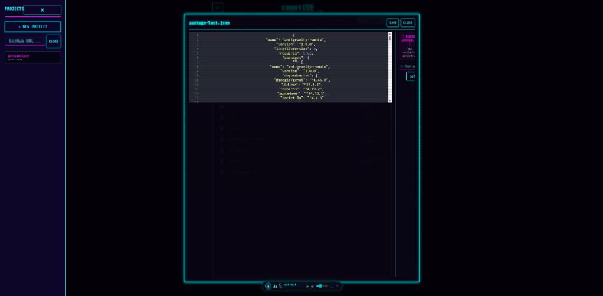

# 🪐 remotIDE

> An Autonomous AI Developer Environment in your browser.

**remotIDE** is a local-host web application that turns any PC into an autonomous AI software development environment. Powered by **Gemini** and local **Ollama** models, it is capable of seamlessly executing terminal commands, scaffolding directory structures, editing code, and browsing the web—all from a sleek Synthwave-inspired mobile-friendly interface.


*(Drop a screenshot of your main UI here!)*

## ✨ Features

- **Autonomous Agent Scaffolding:** Simply ask for a feature, and the AI will generate directories, write files, install NPM packages, and execute PowerShell commands dynamically.
- **Omniscient Context:** The backend recursively reads every file in your project directory (ignoring `node_modules` and `.git`) to give the AI perfect memory of your codebase.
- **Local First & Air-Gapped:** Natively integrates with the `ollama` executable to pull and run models like `llama3` completely offline.
- **Time Machine (Auto-Git):** Every single automated action commits a snapshot of the workspace. A dedicated "Time Machine" button allows you to instantly `git reset --hard HEAD~1` if the AI hallucinates or breaks something.
- **Mobile LAN Connectivity:** Code from your phone on the couch. The sever dynamically discovers your Wi-Fi interface to broadcast a local `http://192.168.x.x:3000` endpoint.
- **Built-in Power Tools:** Integrated CodeMirror syntax highlighter, semantic folder search, syntax linters, port-scanners, and an interactive DOM-fetcher.

## 🚀 Getting Started

### Prerequisites
- [Node.js](https://nodejs.org/) (v16+)
- [Git](https://git-scm.com/)
- *Optional:* [Ollama](https://ollama.com/) (For local offline LLMs)

### Installation

1. **Clone the repository:**
   ```bash
   git clone https://github.com/yourusername/remotIDE.git
   cd remotIDE
   ```

2. **Install dependencies:**
   ```bash
   npm install
   ```

3. **Start the server:**
   ```bash
   node server.js
   ```

4. **Open your browser:**
   Navigate to `http://localhost:3000` (or the IP displayed in your terminal if you want to connect from a mobile device).

## ⚙️ Configuration

Click the **Global Settings (⚙️)** gear icon in the top right of the UI to:
- Input an **Application Access PIN** to lock down your local web interface.
- Provide a [Gemini API Key](https://aistudio.google.com/app/apikey) for cloud processing.
- Trigger automatic downloads of recommended Ollama models.

---

## ⚠️ SECURITY WARNING

**remotIDE is designed exclusively for local-host and secure LAN development.** 

By design, this application is a **Remote Code Execution (RCE) environment**. The Node container has full `child_process.spawn()` privileges to execute shell scripts, read, write, and delete files on your physical hardware. 

**DO NOT host this application on the public internet (AWS, Vercel, Heroku, etc.) without wrapping the Node instance in heavily restricted, under-privileged Docker containers.** 

---

## 🏗️ Architecture

- **Backend:** Node.js, Express, Socket.io
- **Frontend:** Vanilla HTML/CSS/JS (Zero build-step)
- **AI Integrations:** `@google/genai` (Gemini 2.5 SDK), Web `fetch` (Ollama REST API)
- **Utilities:** Puppeteer (Visual QA), native `child_process` (Terminal/FS logic)

## 📄 License
MIT
